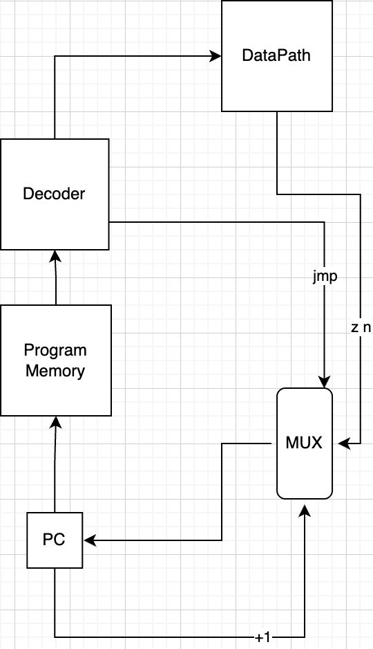
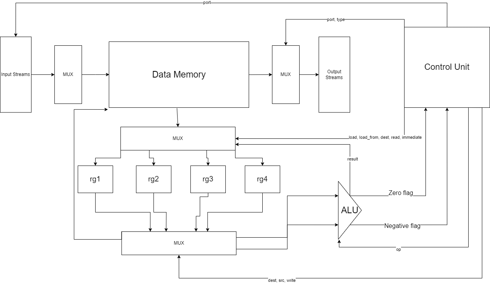

# csa-lab3

- Марков Максим Александрович, P3233
- `asm | risc | harv | mc -> hw | instr | struct | stream | mem | cstr | prob2 `
- Упрощенный вариант.

## Содержание

1. [Язык программирования](#язык-программирования)
2. [Организация памяти](#организация-памяти)
3. [Система команд](#система-команд)
4. [Транслятор](#транслятор)
5. [Модель процессора](#модель-процессора)
6. [Тестирование](#тестирование)

<h2 id="язык-программирования">Язык программирования `ROWLANG` </h2>

``` bnf
<program> ::= <data_section> <text_section>

<data_section> ::= "section .data"
                      {<data_definition>}*

<data_definition> ::= <label> ":" <data_value>

<data_value> ::= <string> | <number>

<string> ::= <char_literal> {<char_literal>}*

<char_literal> ::= "'" <char> "'"

<number> ::= <digit> {<digit>}*

<text_section> ::= "section .text" 
                      {<instruction>}*

<instruction> ::= <label> ":" 
                    {<command>}*

<label> ::= <letter> {<letter> | <digit>}*

<command> ::= "set" <reg> "," <number>
            | "set" <reg> "," <reg>
            | "save" <reg> "," <direct_address>
            | "save" <reg> "," <indirect_address>
            | "sum" <reg> "," <reg> "," <reg>
            | "sub" <reg> "," <reg> "," <reg>
            | "mod" <reg> "," <reg> "," <reg>
            | "cmp" <reg> "," <reg>
            | "jmp" <label>
            | "jeq" <label>
            | "jne" <label>
            | "jl" <label>
            | "break"
            | "print" <reg> "," <port>
            | "printc" <reg> "," <port>
            | "getc" <reg> "," <port>
            | "get" <reg> "," <port>

<reg> ::= "rg1" | "rg2" | "rg3" | "rg4"

<direct_address> ::= <number>

<indirect_address> ::= "(" <reg> ")"

<port> ::= <number>

<letter> ::= "a" | "b" | ... | "y" | "z"
           | "A" | "B" | ... | "Y" | "Z"

<digit> ::= "0" | "1" | ... | "8" | "9"

<char> ::= <letter> | <digit> | <special_char>

<special_char> ::= "!" | "\"" | "#" | "$" | "%" | "&" | "'" | "(" | ")" | "*" | "+" | "," | "-" | "." | "/" | ":" | ";" | "<" | "=" | ">" | "?" | "@" | "[" | "\\" | "]" | "^" | "_" | "`" | "{" | "|" | "}" | "~"
```

### Описание семантики `ROWLANG`


#### Последовательное выполнение
Программа выполняется последовательно, итерируя в списке команд, начиная с первой инструкции в секции `.text` и до момента появления команды `break` или другой команды управления, такой как `jmp`, `jeq`, `jne` или `jl`.

#### Безусловный и условные переходы
- **`jmp <label>`**: Безусловный переход к указанной метке.
- **`jne <label>`**: Условный переход к указанной метке, если флаг Zero не установлен.
- **`jeq <label>`**: Условный переход к указанной метке, если флаг Zero установлен.
- **`jl <label>`**: Условный переход к указанной метке, если флаг Negative установлен.

### Области видимости

#### Глобальные данные
Данные, которые объявленны в секции `.data` находятся в глобальной области видимости. Они всегда доступны для любой инструкции в секции `.text`.

#### Метки
Метки, используемые в секции `.text`, определяют точки в программе, к которым можно перейти с помощью команд ветвления. Метки имеют глобальную область видимости в пределах секции `.text`.

### Виды литералов

#### Числовые литералы
- **Описание**: Целые числа, используемые для инициализации данных, адресации и арифметических операций.
- ***Пример***:
  ```
  max: 100
  set rg1, 100
  ```

#### Символьные литералы
- **Описание**: Последовательности символов, хранящиеся в памяти и используемые для вывода.
- **Пример**:
  ```
  hello: "Hello user!"
  ```

<h2 id="организация-памяти">Организация памяти</h2>

### Модель памяти процессора

- **Размер данных**: 16 бит.
- **Размер инструкций**: инструкции реализованы высокоуровневой структурой данных, для которой, машинное слово не определенно.

#### Варианты адресации
- **Косвенная адресация**: Адрес указывается в регистре. Формат: `(rg1)` означает, что адрес содержится в регистре `rg1`.
- **Прямая адресация**: Адрес указывается непосредственно. Формат: `100` означает, что данные находятся по адресу `100`.

### Механика отображения программы и данных на процессор
```
+----------------------+
|      Registers       |
+----------------------+
| rg1                   |
| rg2                   |
| rg3                   |
| rg4                   |
+----------------------+

+-----------------------+
|   Instruction memory  |
+-----------------------+
| 00 : start            |
| ...                   |
| n  : break            |
| ...                   |
+-----------------------+

+-----------------------+
|      Data memory      |
+-----------------------+
| 00   : num literal    |
| ...                   |
| l    : variable 1     |
| l+1  : variable 2     |
| ...                   |
| c    : char literal   |
| ...                   |
| 1019 : input map1     |
| 1020 : input map2     |
| 1021 : output map1    |
| 1022 : output map2    |
| ...                   |
+-----------------------+
```

#### Виды памяти и регистров, доступные программисту
- **Регистры общего назначения**: rg1, rg2, rg3, rg4.
- **Память данных**: Используется для хранения данных, объявленных в секции `.data` и промежуточных значений.

#### Input/Output
- **Чтение и вывод** осуществляется через input/output буферы, к которые подключены к регистрам памяти.
- **Номер порта** ввода/вывода берётся из регистра port.

<h2 id="система-команд">Система комад:</h2>

#### Команда `set`
- **Семантика**: Перемещает данные из одного регистра в другой или число в регистр.
- **Пример**:
  ```
  set rg1, 10     ; rg1 = 10
  set rg2, rg1    ; rg2 = rg1 (rg2 = 10)
  set rg2, (rg1)  ; rg2 = память[адрес значения rg1]
  ```

#### Команда `save`
- **Семантика**: Сохраняет данные из регистра в память по указанному адресу.
- **Пример**:
  ```STORE R1, (R2)  ; память[адрес, указанный в R2] = R1
  save rg3, 100   ; память[адрес 100] = rg3
  save rg3, (rg4) ; память[адрес значения rg4] = rg3
  ```

#### Команда `sum`
- **Семантика**: Складывает значения из двух регистров и сохраняет результат.
- **Пример**:
  ```
  sum rg1, rg2  ; rg1 = rg1 + rg2
  ```

#### Команда `sub`
- **Семантика**: Вычитает значение одного регистра из другого и сохраняет результат.
- **Пример**:
  ```
  sub rg1, rg2  ; rg1 = rg1 - rg2
  ```

#### Команда `mod`
- **Семантика**: Выичсляет остаток от отделения первого регистра на второй и сохраняет.
- **Пример**:
  ```
  mov rg1, rg2  ; rg1 = rg1 % rg2
  ```

#### Команда `cmp`
- **Семантика**: Сравнивает значения двух регистров и устанавливает флаг состояния Zero, если значения равны.
- **Пример**:
  ```
  cmp rg1, rg2      ; Устанавливает флаг Zero, если rg1 == rg2
  ```

#### Команда `jmp`
- **Семантика**: Безусловный переход к указанной метке.
- **Пример**:
  ```
  jmp loop       ; Переход к метке loop
  ```

#### Команда `jeq`
- **Семантика**: Условный переход к указанной метке, если флаг Zero установлен.
- **Пример**:
  ```
  jeq branch       ; Переход к метке branch, если флаг Zero установлен
  ```

#### Команда `jne`
- **Семантика**: Условный переход к указанной метке, если флаг Zero не установлен.
- **Пример**:
  ```
  jne branch       ; Переход к метке branch, если флаг Zero не установлен
  ```

#### Команда `jl`
- **Семантика**: Условный переход к указанной метке, если флаг Negative установлен.
- **Пример**:
  ```
  jl branch       ; Переход к метке branch, если флаг Negative установлен
  ```


#### Команда `break`
- **Семантика**: Останавливает выполнение программы.
- **Пример**:
  ```
  break            ; Остановка программы
  ```

#### Команда `print`
- **Семантика**: Выводит численные данные из регистра на указанный порт.
- **Пример**:
  ```
  print rg1, 1       ; Вывод значения из rg1 на порт 1
  ```
#### Команда `printc`
- **Семантика**: Выводит символьные данные из регистра на указанный порт.
- **Пример**:
  ```
  printc rg1, 1       ; Вывод значения из rg1 на порт 1
  ```

#### Команда `get`
- **Семантика**: Загружает целочисленные данные с указанного порта в регистр.
- **Пример**:
  ```
  get rg1, 0        ; Загрузка значения с порта 0 в rg1
  ```

#### Команда `getc`
- **Семантика**: Загружает символьные данные с указанного порта в регистр.
- **Пример**:
  ```
  getc rg1, 0        ; Загрузка значения с порта 0 в rg1
  ```

<h2 id="транслятор">Транслятор</h2>

Транслятор предназначен для перевода `rowlang` кода в `JSON` формат. Он читает исходный файл, обрабатывает и сохраняет результат в `JSON` файл.

### Интерфейс командной строки

Транслятор запускается из командной строки с указанием входного файла (файла с исхоным кодом `rowlang`) и выходного файла (файла, в который будет записан `JSON`).

Пример использования:

    python translator.py input.rowlang output.json

### Принципы работы транслятора

Транслятор выполняет следующие этапы:

1. **Чтение и разделение секций `.data` и `.text`**:
    - `rowlang` код разделяется на секции `.data` и `.text`. Секция `.data` содержит данные, а секция `.text` - команды.

2. **Обработка секции `.data`**:
    - Каждая строка секции `.data` обрабатывается для извлечения меток и значений.
    - Значения добавляются в список данных, и соответствующие метки запоминаются с их адресами.

3. **Обработка секции `.text`**:
    - Каждая строка секции `.text` обрабатывается для извлечения команд и их аргументов.
    - Если строка содержит метку, эта метка запоминается с текущим адресом команды.
    - Команды добавляются в список текстовых инструкций.

4. **Замена меток на адреса и формирование инструкций**:
    - В командах текстовой секции метки заменяются на их адреса.
    - Форматируются аргументы команд в зависимости от их типа (`регистр`, `число`, `косвенный адрес`).

5. **Генерация `JSON`**:
    - Сформированные данные и текстовые инструкции преобразуются в `JSON` формат.

### Пример работы

Пример входного ассемблерного кода:
```
section .data
    hello 'Hello, World!'

section .text
_start:
    set rg1, hello
    set rg3, 0
  loop:
    set rg2, (rg1)
    printc rg2, 2
    cmp rg2, rg3
    jeq end
    set rg2, 1
    sum rg1, rg2
    jmp loop
  end:
    break
```
После обработки этот код преобразуется в следующий JSON:
```
{"data": [72, 101, 108, 108, 111, 44, 32, 87, 111, 114, 108, 100, 33, 0], "text": [{"opcode": "set", "args": [{"reg": "rg1"}, {"number": "0"}]}, {"opcode": "set", "args": [{"reg": "rg3"}, {"number": "0"}]}, {"opcode": "set", "args": [{"reg": "rg2"}, {"indir_reg": "rg1"}]}, {"opcode": "printc", "args": [{"reg": "rg2"}, {"number": "2"}]}, {"opcode": "cmp", "args": [{"reg": "rg2"}, {"reg": "rg3"}]}, {"opcode": "jeq", "args": [{"number": "9"}]}, {"opcode": "set", "args": [{"reg": "rg2"}, {"number": "1"}]}, {"opcode": "sum", "args": [{"reg": "rg1"}, {"reg": "rg2"}]}, {"opcode": "jmp", "args": [{"number": "2"}]}, {"opcode": "break", "args": []}]}
```
Реализован в модуле [транслятора](translator.py).

<h2 id="модель-процессора">Модель процессора</h2>

### Control Unit



### Data Path


Программная реализация [Control Unit](runnable/control_unit.py) и [Data Path](runnable/datapath.py).

<h2 id="тестирование">Тестирование</h2>


Этот проект использует непрерывную интеграцию (CI) с помощью GitHub Actions для автоматического запуска линтинга и тестов при каждом пуше или пул-реквесте.

### Тесты

Golden tests реализованны в файле [тестов](golden_test.py), данные для проверки хранятся [здесь](golden).

#### Тесты реализованы на программах:
- [cat](programs/cat.rowlang)
- [helloworld](programs/helloworld.rowlang)
- [hellouser](programs/hellouser.rowlang)
- [prob2](programs/prob2.rowlang)

## Статистика
<div style="overflow-x: auto;">

| ФИО                         | алг       | LoC  | code байт | code инстр. | инстр. | такт. | вариант                                                                             |
|-----------------------------|-----------|------|-----------|-------------|--------|-------|-------------------------------------------------------------------------------------|
| Марков Максим Александрович | hello     | 15   | -         | 10          | 99     | 463   | asm \| risc \| harv \| hw \| instr \| struct \| stream \| mem \| cstr \| prob2  |
| Марков Максим Александрович | cat       | 5    | -         | 19          | 44     | 202   | asm \| risc \| harv \| hw \| instr \| struct \| stream \| mem \| cstr \| prob2  |
| Марков Максим Александрович | hellouser | 54   | -         | 52          | 275    | 1293  | asm \| risc \| harv \| hw \| instr \| struct \| stream \| mem \| cstr \| prob2  |
| Марков Максим Александрович | prob2     | 61   | -         | 42          | 443    | 2137  | asm \| risc \| harv \| hw \| instr \| struct \| stream \| mem \| cstr \| prob2  |

</div>
